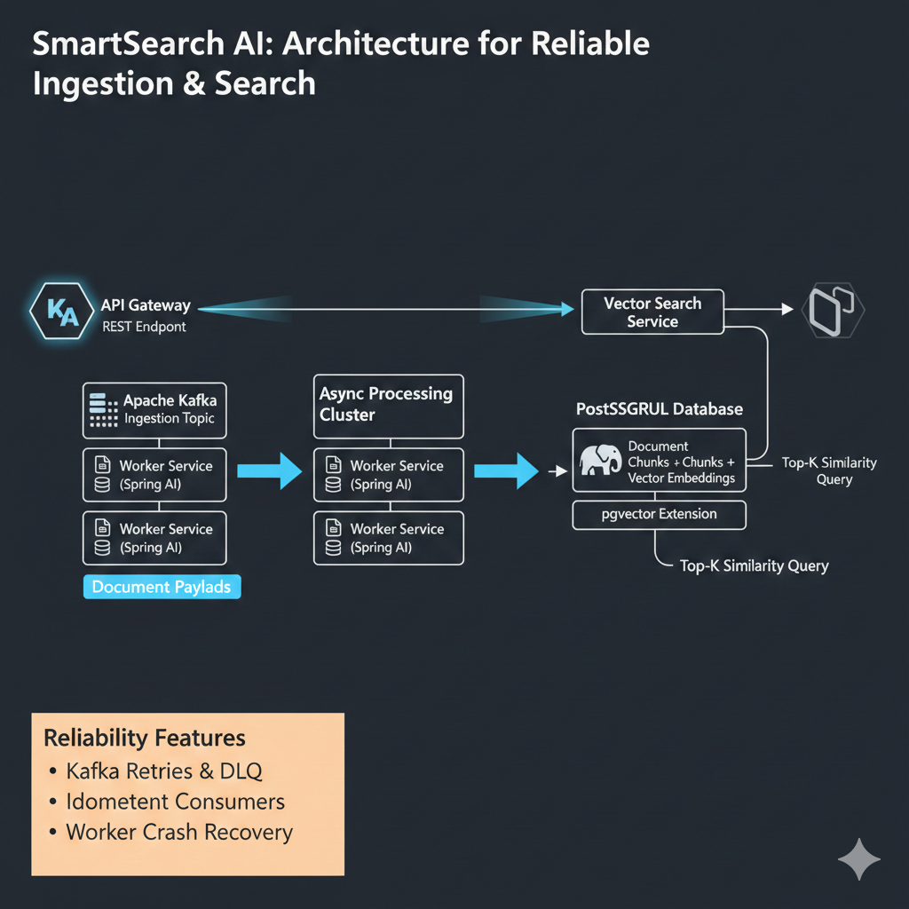

# SmartSearch — Fault-Aware Asynchronous Ingestion + Semantic Retrieval

SmartSearch is a production-style backend designed to maintain **correctness under failure**.

It ingests documents via **Kafka-based asynchronous processing**, persists embeddings in **Postgres/pgvector**, and exposes semantic search and RAG APIs and ensures **idempotency, retry safety, and explicit job state tracking**.

---

## Why this is not another RAG demo

- **Crash recovery:** worker failures do not lose data — ingestion resumes safely
- **Idempotency:** duplicate requests and Kafka replays do not create duplicate chunks
- **Explicit lifecycle:** PENDING → PROCESSING → READY / FAILED
- **Retry system:** failed or stuck jobs can be retried or republished safely
- **Backpressure visibility:** `/api/system/pressure` exposes system load in real time
- **Fast-fail safety:** ingestion is rejected if the database is unavailable

---

## Core Capabilities

- Event-driven ingestion pipeline (API → Kafka → Worker → Postgres)
- Idempotent chunk storage preventing duplicate writes
- Stateful job lifecycle tracking (PENDING → PROCESSING → READY / FAILED)
- Semantic retrieval via pgvector similarity search
- RAG-based question answering with grounded citations

  


------------------------------------------------------------------------

## 🧠 SmartSearch Architecture

<p align="center">
  
</p>

<p align="center">
  <em>End-to-end architecture: API → Kafka → Async Workers → pgvector → Vector Search</em>
</p>


### Architecture Notes

The system uses Kafka to decouple ingestion from processing, enabling
failure recovery, retry handling, and consistent state transitions
without blocking API responsiveness.

## System Guarantees

- At-least-once ingestion with retry safety
- No duplicate chunks under Kafka replay
- Crash-safe processing with no data corruption
- Deterministic job state transitions (PENDING → PROCESSING → READY / FAILED)

## Failure Scenarios (Validated)

The system was tested under failure conditions using controlled fault injection
(process termination, Kafka interruption, DB unavailability, and message replay).

### Worker & Crash Resilience
- Worker killed mid-processing → message is reprocessed safely
- Worker killed after DB write → no duplicate chunks created
- Worker restart → resumes from correct Kafka offset
- Kafka broker stopped → worker recovers after restart
- Database unavailable → retries succeed without data loss

### Retry & Idempotency
- Consumer exceptions trigger bounded retries
- Retry exhaustion → job marked as **FAILED** and sent to DLQ
- Kafka message replay → no duplicate chunks (idempotent writes)
- Duplicate API requests → same `requestId` handled safely

### Ordering & Offset Correctness
- Burst ingestion (20+ messages) → all messages processed
- Worker restart mid-burst → no message loss
- Kafka offset progression remains correct and monotonic

### End-to-End Validation
- Single document ingestion → SUCCESS
- Bulk ingestion (10–50 docs) → all succeed
- Large document ingestion → no timeout or partial state
- Post-ingestion search → returns correct chunks

### Database Consistency
- No stuck PENDING jobs after recovery
- No partial or half-written chunk state
- Correct lifecycle transitions:
  **PENDING → PROCESSING → READY / FAILED**

### Failure State Handling
- Permanent failures persist as **FAILED**
- Failed jobs are not reprocessed automatically
- DLQ contains messages exceeding retry limits

## Future Validation (Planned)

The following scenarios are identified for further strengthening system robustness:

- Concurrency validation with multiple workers (no duplicate processing)
- High-load ingestion stability (100+ concurrent requests)
- Kafka rebalance handling and safe recovery
- Crash consistency edge cases (pre/post commit scenarios)
- Observability improvements (latency, retries, DLQ metrics)
- End-to-end request tracing via request_id  

------------------------------------------------------------------------

## API

### POST /api/documents
```bash
curl -X POST http://localhost:8080/api/documents \
  -H "Content-Type: application/json" \
  -d '{"requestId":"doc-1","text":"..."}'

GET /api/search
curl "http://localhost:8080/api/search?q=mvba&k=3"

GET /api/ask
curl "http://localhost:8080/api/ask?q=What%20is%20MVBA%3F&k=5"

**Quickstart**
docker compose up
./mvnw spring-boot:run


**Key Design Decisions**
- Idempotency: requestId uniqueness prevents duplicate ingestion
- At-least-once processing: Kafka retries + safe replay handling
- State machine: PENDING → PROCESSING → READY / FAILED
- Failure isolation: ingestion decoupled via Kafka

**Roadmap**
- Observability (metrics + dashboards)
- Performance benchmarking
- Load testing under sustained ingestion
- Observability: latency, retry count, DLQ metrics
